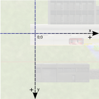
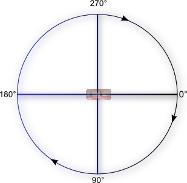

# 基本概念

GDevelop 是一个免费的，开源的，跨平台的游戏创建工具，任何人都可以使用它来开发具有编程技能的游戏。

```txt
1、只支持2D，无须编码
2、支持导出安卓，IOS，web，html5，facebook即时游戏，cocos2d-js（实验）
3、不支持导出cocos creator、微信小游戏
```

## 对象

在 GDevelop 中，将在屏幕上显示的内容都称为对象，可以使用不同类型的对象在屏幕中显示不同的游戏元素，有如下几种类型：

- Sprite（精灵）：可用于游戏中的大部分对象（例如玩家，敌人，一些游戏内的单个元素等）
- Tiled Sprite（平铺精灵）：显示在一个区域上重复的图片（例如背景，障碍物，金币等）
- Text （文字）：在屏幕上显示的文本
- Particles emitter（粒子发射器）：显示大量的小颗粒以产生视觉效果（例如碰撞后产生的效果）
- Panel Sprite ("9-patch")（画板精灵）：面板精灵对象可用于显示具有重复或拉伸边框的纹理。面板精灵对象对于构造具有动态尺寸的对象很有用
- Shape painter（形状绘画）：用来绘制简单的图形
- Text entry（文字输入）：用于获取用键盘输入的文本的不可见对象；可以使用此对象来模拟文本输入字段（例如，您可以使用文本输入对象来提供一种方法，使游戏玩家可以输入他/她的姓名或任何其他信息。）
- BBText：BBText 对象在屏幕上显示丰富的“多样式”文本。您可以使用“ BBCode”样式标签来自定义文本不同部分的样式属性（例如，大小和颜色）。您还可以在游戏过程中使用事件来修改 BBText 对象的属性。
- Lights（灯光）：在场景中使用光线，并可以自定义半径和颜色，然后在必须作为灯具障碍的对象中添加轻障碍行为
- Video（视频）：用于显示视频，可以使用事件来控制视频：时间，状态（播放/暂停），音量

> ？平铺精灵跟画板精灵的区别

## 坐标

`GDevelop` 屏幕/场景上的对象具有 `X` 和 `Y` 坐标。这些坐标对应于笛卡尔平面上的水平位置（`X` 轴）和垂直位置（`Y` 轴）。

`X` 坐标随着您向左移动而减小，并且随着您向右移动而增大。`Y` 坐标随着您的下降而增加，而随着您的上升而减小



为了移动或旋转对象，您需要指定所需的角度（以度为单位）



## 事件（Events）

事件由条件(condition)和行为(action)组成

### 条件

### 行为

## 移动物体的方式：内置力

## 变量

## TimeDelta：自上一帧以来的“经过的时间”
