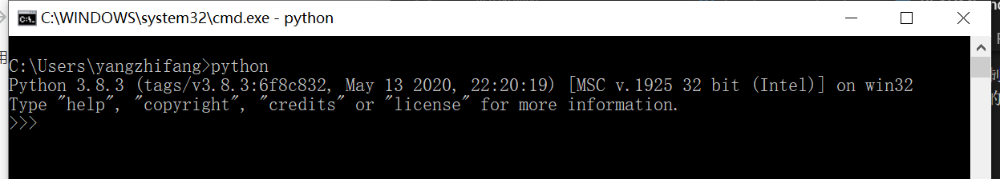
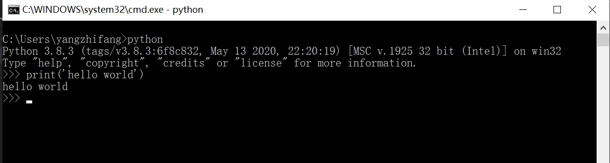

# Python 学习笔记

[通过视频学习所记](https://www.bilibili.com/video/BV1vA411b7Rn)

## 介绍
`Python` 是一种 **面向对象**的**解释型计算机程序设计语言**，能够把其他语言制作的各种模块（尤其是c/c++）很轻松的联结在一起（第一个公开发行版发布于1991年，常称为胶水语言）

发展历程：
- 1991年：发布第一个版本
- 2000年：发布 `Python2.0`，增加垃圾回收机制，支持 `Unicode`
- 2008年：发布 `Python3.0`，此版本不完全兼容之前的 `Python` 源代码
- 2020年：官方将不再支持 `Python2.0`版本

排名：
- 2019年：No.4
- 2020年：No.3

优点：
- 简单，易学
- 免费，开源
- 丰富的第三方库
- 可以移植
- 面向对象

缺点：
- 运行速度慢：因为是解释性语言，需要逐行翻译成CPU能理解的机器码(0101...)
- 代码不能加密
- 强制的缩进
- GIL全局解释器锁（？？？？）：在任意时刻，只有一个线程在解释器中运行。对Python虚拟机的访问由全局解释器锁来控制，正式这个锁能保证同一时刻只有一个线程在运行。遇到i/o阻塞时会释放掉GIL，所以Python的多线程并不是真正的多线程，而是CPU执行速度非常快，让人感觉不到GIL的存在

用处：
- web后台开发
- 爬虫开发
- 数据分析
- 运维开发
- 机器学习
- 人工智能

## 安装
下载安装包：[官方网站](https://www.python.org/)

下载开发文档：[开发文档](https://docs.python.org/3/)

验证是否安装成功：
进入命令行，输入 `python` 回车，展示出版本提示（如下图）为成功，此时已经进入 `python` 交互式环境


打印 Hello World：


退出 `python` 交互式环境：在环境输入 exit() 或 quit() 回车退出

执行文件：声明一个 `.py` 文件，执行 `python *.py`

注释：
- 单行注释：用 `#` 来标识
- 多行注释：用 `'''` 或者 `"""`
- 还有两个特殊的注释：平台注释（指定py解析器的路径）和编码注释（指定编码格式，主要用于python2.0），这两句只能写在py文件的最前面

```py
#!/usr/bin/python3
# --- coding=utf8

# 打印数据
print('hello') 

'''
这个是多行注释
print('hello') 
'''
```

适用于专业开发人员的 `Python IDE`：`PyCharm`，此IDE可以帮助开发者通过PEP8检查、测试帮助、智能重构和一系列检查来保持质量
- [官方下载](https://www.jetbrains.com/zh-cn/pycharm/promo/)


## 数据类型
- 数字(num)
  - int （有符号证书）
  - long （长整型，python3 取消）
  - float （浮点型）
  - complex（复数）
  - bool（布尔值）
    - True
    - False
- 字符串(str)
- 字典(dict)
- 元祖(Tuple)
- 列表(list)

可以使用 `type()` 判断数据类型：
```py
a = 10
print(type(a)) # <class 'int'>

a = 12.6
print(type(a)) # <class 'float'>

a = 'hahaha'
print(type(a)) # <class 'str'>

a = True
print(type(a)) # <class 'bool'>

b = ()
print(type(b)) # <class 'dict'>

c = []
print(type(c)) # <class 'list'>

d = {}
print(type(d)) # <class 'dict'>

```

变量命名规则：
- 必须以字母或下划线开头
- 其他字符可以是字母、数字或下划线
- 变量区分大小写
- Python关键字不能作为变量名


## 基本操作符
算数运算符：`+`、`-`、`*`、`/`、`%`、`**`(幂)、`//`(除取整)
```py
a = 7
b = 3
# 还可以这样声明  a, b = 7, 3

print(a + b) # 10
print(a - b) # 4
print(a * b) # 21
print(a / b) # 2.3333333333333335
print(a % b) # 1
print(a ** b) # 343
print(a // b) # 2
```

比较运算符：`==`、`!=`、`>`、`<`、`>=`、`<=`

逻辑运算符：`and`、`or`、`not`，优先级：`() => not => and => or`

赋值运算符：`=`、`+=`、`-=`、`*=`、`/=`、`%=`、`**=`(幂赋值运算符)、`//=`(取整赋值运算符)


## 输入和输出

输入与输出：`%c`(字符)、`%s`(字符串)、`%i`(有符号十进制整数)、`%d`(有符号十进制整数)、`%u`(无符号十进制整数)、`%o`(八进制整数)、`%x`(十六进制整数，小写字母)、`%e`(索引符号，小写e)、`%E`(索引符号，大写E)、`%f`(浮点实数)、`%g`(%f和%e的简写)、`%G`(%f和%E的简写)

- 输入：
```py
name = 'python'
name1 = 'world'
a = 10
print('hello:%s:%s:%d' % (name, name1, a))

# hello:python:world:10

name = '老夫子'
QQ = '6666666'
phone = '13800138000'

# 方式一
# print('姓名：%s' % (name))
# print('QQ：%s' % (QQ))
# print('手机号：%s' % (phone))

# 方式二
# print('姓名：{}'.format(name))
# print('QQ：{}'.format(QQ))
# print('手机号：{}'.format(phone))

# 更简单的方式
print('姓名：{}\nQQ：{}\n手机号：{}'.format(name, QQ, phone))
```

- 输出：
```py
name = input('请输入姓名')
age = int(input('请输入年龄'))
QQ = input('请输入QQ')
phone = input('请输入电话')

print('姓名：{}\n年龄：{}\nQQ：{}\n手机号：{}'.format(name, age, QQ, phone))

```

## 流程控制结构
- `if-else` 语句

```py
# 猜拳游戏
import random
person = int(input('请出拳：[0: 石头，1：剪刀，2：布]'))
computer = random.randint(0, 2)
if person == 0 and computer == 1 or person == 1 and computer == 2 or person == 2 and computer == 1:
  print('你赢了')
  pass
elif person == computer:
  print('平手')
  pass
else:
  print('你输了')

```

- `while` 循环

```py
# 打印九九乘法表
row = 9
while row >= 1:
  col = 1
  while col <= row:
    print('%d*%d=%d' % (row, col, row*col), end=' ')
    col += 1
    pass
  print()
  row -= 1
  pass
```

- `for` 循环

```py
# range 此函数可以生成一个数据集合列表
# range(起始值,结束,步长（步长不能为0）)
for data in range(50, 201):
  if data % 2 == 0:
    print('偶数%d'%data)
    pass
  else:
    print('奇数%d'%data)

# 用for循环实现九九乘法表
for i in range(1,10):
  for j in range(1, i + 1):
    print('%d*%d=%d' % (i, j, i*j), end=' ')
    pass
  print()
  pass
```

- `break、continue` 语句

break: 中断循环
continue：结束本次循环，继续进行下次循环
这两个关键字只能用在循环中

- for----else

```py
for item in range(1, 11):
  print(item, end=' ')
  if item >= 5:
    break
  pass
else:
  print('上面循环中只要出现了break，就执else')

# 可用于账号输入超过次数，则禁止执行
account = 'dd'
pwd = '123'
for i in range(3):
    zh = input('账号')
    pd = input('密码')
    if zh == account and pwd == pd:
        print('登录成功')
    pass
else:
    print('您的账号已被系统锁定')
```

- while----else （同for----else）