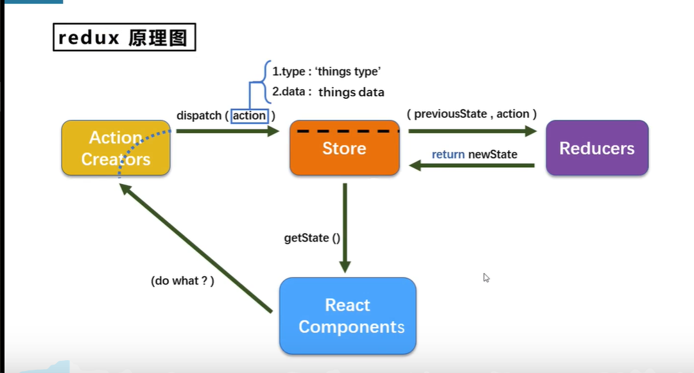

## react入门

React基础

React-Router => 路由

PubSub =>  消息管理库

Redux => 集中式状态管理

Ant-Design => ui 组件库


### React基础


react是什么？

> 用于构建用户界面的javascript库（react只关注视图，只管页面的呈现） =》
>
> 是一个将数据渲染为html视图的开源javascript库


谁开发的？

> 由facebook开发，且开源（2013年）


为什么学？

> 原生js操作DOM繁琐，效率低（dom api 操作ui）
>
> 使用js直接操作dom，浏览器会进行大量的重绘重排
>
> 原生js没有组件化的编码方案，代码复用率低


react特点

> 采用组件化模式、声明式编码，提高开发效率及组件复用率
>
> 在React Native中可以使用React语法进行移动端开发
>
> 使用虚拟DOM+优秀的Diffing算法，尽量减少与真实DOM的交互


学react之前要掌握的js基础知识

> 判断this的指向
>
> class（类）
>
> ES6语法规范
>
> npm包管理器
>
> 原型、原型链
>
> 数据常用方法
>
> 模块化


### React基本使用


HelloWorld

```js
```


相关js库

> react.js: react核心库
>
> react-dom.js: 提供操作DOM的react扩展库
>
> babel.min.js: 解析解析、jsx语法代码转成js代码的库


虚拟dom的创建方式（jsx）

```jsx
// 创建虚拟dom
const VDOM = (
  <h1>
    <span>Hello</span>
  </h1>
)

// 渲染虚拟DOM到页面
ReactDom.render(VDOM, document.getElementById('#app'))
```


虚拟dom的创建方式（js）,一般不用

```js
// 创建虚拟dom
const VDOM = React.createElement('h1', {id: 'title'}, 'Hello')

// 渲染虚拟DOM到页面
ReactDom.render(VDOM, document.getElementById('#app'))
```


虚拟DOM

>1、本质是Object类型的对象（一般对象）
>
>2、虚拟DOM比较“轻”，真是DOM比较“重”，因为虚拟DOM是react内部在使用，无需真实DOM那么多的属性
>
>3、虚拟DOM最终会被react转换为真是DOM，呈现在页面上


### React JSX


JSX介绍

> 1、全称：Javascript XML
>
> 2、React定义的一种类似于XML的js扩展语法：JS+XML
>
> 3、本质是React.createElement(component, props, ...children) 方法的语法糖
>
> 4、作用：用来简化创建虚拟DOM
>
> ​	（1）写法：`var ele = <h1>Hello</h1>`
>
> ​	（2）注意一：它不是字符串，也不是HTML/XML标签
>
> ​	（3）注意二：它最终产生的就是一个js对象
>
> 5、标签名任意：HTML标签或其他标签

规则

> 1、定义虚拟DOM时，不需要写引号
>
> 2、标签中混入js表达式时要用` {}`【注意区分js语句（代码）和js表达式】
>
> ​	（1）表达式：一个表达会产生一个值，可以放在任何一个需要值的地方
>
> ​				例如：`a，a+b、demo(1)、arr.map()、function test(){}`
>
> ​	（2）语句（代码）：
>
> ​				例如：`if，for(){}，switch(){case:xxx}`
>
> 3、样式的类名指定不要用class，而要用className
>
> 4、内联样式，要用
```tsx 
style={{key: value}}
``` 
的形式写
>
> 5、只能有一个根标签
>
> 6、标签必须闭合
>
> 7、标签首字母
>
> ​	（1）若小写字母开头，则将标签转为html中同名元素，若html中无该标签对应的同名元素，则报错
>
> ​	（2）若大写字母开头，react就去渲染对应的组件，如果没有对应，则报错


### 模块与组件、模块化与组件化的理解

模块

> 理解：向外提供特定功能的js程序，一般就是一个js文件
>
> 为什么要拆模块：随着业务的逻辑增加，代码越来越多且复杂
>
> 作用：复用js，简化js的编程，提交js运行效率


组件

> 理解：用来实现布局功能效果的代码和资源集合
>
> 为什么：一个界面的功能更复杂
>
> 作用：复用编码，简化项目编码，提高运行效率


模块化

> 当应用的js都以模块来编写的，这个应用就是一个模块化应用


组件化

> 当应用是以多个组件的方式实现，这个应用就是一个组件化的应用


## React面向组件编程

### 基本理解和使用


使用react开发者工具（react developer tool）

函数式组件：用函数定义的组件（适用于【简单组件】的定义）

```jsx
// 创建函数式组件
function MyComponent(){
  console.log(this)// undefined, 因为babel编译后开启严格模式
  return <h2>我是函数式组件</h2>
}
// 渲染组件到页面
ReactDOM.render(<MyComponent/>, document.getElementById('app'))
/*
执行了 ReactDOM.render(<MyComponent/>。。。。 之后，发生了什么
1、React解析组件标签，找到MyComponent组件
2、发现组件是函数定义的，随后调用该函数，将返回的虚拟dom转为真实dom，然后呈现在页面中
*/
```


类式组件：用类定义的组件（适用于【复杂组件】的定义）

类的基本知识：

> 1、类中的构造器不是必须写的，要对实例进行一些初始化的操作，如添加指定属性时才写
>
> 2、如果A类继承了B类，且A类中写了构造器，那么A类构造器中的super是必须要调用的
>
> 3、类中所定义的方法，都是放在了类的原型对象上，供实例去使用
>
> 4、类中的方法this指向：类中的方法默认开启了局部的严格模式
>
> 5、类中可以直接写赋值语句

```tsx
class A{
...
// 给实例对象A添加属性a
a = 1	
...
}
```


```jsx
// 创建类式组件
class MyComponent extends React.Component {
  render(){
    // render是放在类（MyComponent）的原型对象上，供实例使用
    // render中的this是MyComponent的实例对象（MyComponent组件实例对象）
    return (
      <h2>我是类式组件</h2>
    )
  }
}
// 渲染组件
ReactDOM.render(<MyComponent/>, document.getElementById('app'))
/*
执行了 ReactDOM.render(<MyComponent/>。。。。 之后，发生了什么
1、React解析组件标签，找到MyComponent组件
2、发现组件是使用类定义的，随后new出来该类的实例，并通过该实例调用到原型上的render方法
3、将render返回的虚拟DOM转为真实DOM，随后呈现在页面中
*/
```


### 组件的三大核心属性1：state

```jsx
// 创建类式组件
class Wether extends React.Component {
  // 构造器调用几次？———— 1次
  constructor(props){
    super(props)
    // 初始化状态
    this.state = {
      isHot: true,
      wind: '微风'
    }
    // 解决changeWeather的this指向
    this.changeWeather = this.changeWeather.bind(this)
  }
  // render调用几次？————1+n次（1是初始化的那次，n是状态更新的次数）
  render(){
    // 读取状态
    let {isHot, wind} = this.state
    return (
      <h2 onClick={this.changeWeather}>多云{isHot ? '炎热' : '凉爽'}， {wind}</h2>
    )
  }
  // changeWeather调用几次————点几次调用几次
  changeWeather(){
    // changeWeather放在Weather的原型对象上，供实例使用
    // 由于changeWeather是作为onClick的回调，所以不是通过实例调用的，是直接调用
    // 类中的方法默认开启了局部的严格模式，所以changeWeather中的this为undefined
    /* 解决this指向问题：bind  	
    */
	// console.log(this) // undefined
    const isHot = this.state.isHot
    // 注意：状态（state）不能直接更改
	 	// this.state.isHot = !isHot // 错误写法
    
    // 状态必须通过setState进行更新，且更新是一种合并，不是替换
    this.setState({isHot: !isHot})
    
  }
}
// 渲染组件
ReactDOM.render(<Wether/>, document.getElementById('app'))

```

简写

```jsx
// 创建类式组件
class Wether extends React.Component {
  // 初始化状态
  state = {
      isHot: true,
      wind: '微风'
  }

  render(){
    let {isHot, wind} = this.state
    return (
      <h2 onClick={this.changeWeather}>多云{isHot ? '炎热' : '凉爽'}， {wind}</h2>
    )
  }

	// 自定义方法——要用赋值语句的形式+箭头函数
  changeWeather = () => {
    const isHot = this.state.isHot
    this.setState({isHot: !isHot})    
  }
}
// 渲染组件
ReactDOM.render(<Wether/>, document.getElementById('app'))

```

> state是组件对象最重要的属性，值是对象（可以包含多个key-value的组合）
>
> 组件被称为“状态机”，通过更新组件的state来更新对应的页面显示（重新渲染组件）
>
> 注意事项：
>
> 1、组件中render方法中的this为组件实例对象
>
> 2、组件自定义的方法中this为undefined，如果解决
>
> ​	（1）强制绑定this，通过函数对象的bind()
>
> ​	（2）箭头函数
>
> 3、状态数据不能直接更改或更新，需要通过setState({key: value})


### 组件的三大核心属性2：props

```jsx
// 创建组件
class Person extends React.Component{
  render(){
    // props是只读的
    let {name, sex, age} = this.props
    return (
			<ul>
				<li>姓名：{name}</li>
 				<li>性别：{sex}</li>
 				<li>年龄：{age}</li>
      </ul>
    )
  }
}
// 对属性标签属性进行限制
// 15.XXX之前 React.PropTypes能用
// 16.xxx之后 React.PropTypes报错，需要引入prop-types库，之前通过PropTypes调用
Person.propTypes = {
  // 必传且限制为字符串
  name: PropTypes.string.isRequired,
  // 限制为数值
  age: PropTypes.number,
  // 限制为字符串
  sex: PropTypes.string,
  // 限制为函数
  speak: PropTypes.func
}
// 指定默认标签属性值
Person.defaultProps = {
  sex: '男',
  age: 18
}
// 渲染组件
// ReactDOM.render(<Person name="tom" age="18" sex="女"/>, document.getElementById('app'))

// 批量传递数据
let p = {name: 'tom', age: 18, sex: '女'}
ReactDOM.render(<Person {...p}/>, document.getElementById('app'))
```

简写

```jsx
// 创建组件
class Person extends React.Component{
  // constructor(props){
    // 构造器是否接受props，是否传递super，取决于：是否希望在构造器中通过this访问props
    // 这种情况用得比较少，能省略则省略
    // super(props)
  // }
  static propTypes = {
    name: PropTypes.string.isRequired,
    age: PropTypes.number,
    sex: PropTypes.string,
    speak: PropTypes.func
  }
  static defaultProps = {
    sex: '男',
    age: 18
  }
  render(){
    let {name, sex, age} = this.props
    return (
			<ul>
				<li>姓名：{name}</li>
 				<li>性别：{sex}</li>
 				<li>年龄：{age}</li>
      </ul>
    )
  }
}

// 渲染组件
// ReactDOM.render(<Person name="tom" age="18" sex="女"/>, document.getElementById('app'))


// 批量传递数据
let p = {name: 'tom', age: 18, sex: '女'}
ReactDOM.render(<Person {...p}/>, document.getElementById('app'))
```


函数式组件使用props：函数式只能使用props，其他的用不了，最新版本的hooks可以用

```jsx
// 创建组件
function Person(props) {
  let {name, sex, age} = props
  return (
    <ul>
      <li>姓名：{name}</li>
      <li>性别：{sex}</li>
      <li>年龄：{age}</li>
    </ul>
  ) 
}
Person.propTypes = {
  name: PropTypes.string.isRequired,
  age: PropTypes.number,
  sex: PropTypes.string,
  speak: PropTypes.func
}
Person.defaultProps = {
  sex: '男',
  age: 18
}

// 渲染组件
ReactDOM.render(<Person name="tom" age="18" sex="女"/>, document.getElementById('app'))

```


> 1、理解
>
> （1）每个组件对象都会有props属性
>
> （2）组件标签的所有属性都保存在props中
>
> 2、作用
>
> （1）通过标签属性从组件向外组件内传递变化的数据
>
> （2）注意：组件内部不要修改props数据
>
> 3、操作
>
> （1）内部读取某个属性值：`this.props.name`
>
> （2）对props中的属性值进行类型限制和必要性限制
>
> ​		1）react15.5开始弃用
>
> ​		Person.propTypes = {
>
> ​			name: React.PropTypes.string.isRequired,
>
> ​			age: React.PropTypes.number
>
> ​		}
>
> ​		2) 使用prop-types库进行限制（需要引入prop-types库）
>
> ​		Person.propTypes = {
>
> ​			name: PropTypes.string.isRequired,
>
> ​			age: PropTypes.number
>
> ​		}
>
> （3）扩展属性：将对象的所有属性通过props传递
>
> ​	`<Person {...person}/>`
>
> （4）默认属性值
>
> ​	`Person.defaultProps = {age: 18, sex: '男'}`	
>
> （5）组件类的构造函数
>
> ​	`constructor(props){ super(props); console.log(props) // 打印所有属性 }`


### 组件的三大核心属性3：refs与事件处理

字符串形式的ref（官网已不推荐使用，可能会在未来的版本中移除）

```jsx
class Demo extends React.Component{  
  showData = () => {
    const {input1} = this.refs
    console.log(input1.value)
  }
  
  showData2 = () => {
    const {input2} = this.refs
    console.log(input2.value)
  }
  
  render(){
    return (
    	<div>
        <input ref="input1" type="text" placeholder="点击按钮提示数据"/>
        <button  onClick={this.showData}>点我提示左侧的数据</button>
        <input onBlur={this.showData2} ref="input2" type="text" placeholder="失去焦点提示数据"/>
      </div>
    )
  }
}

ReactDom.render(<Demo/>, document.querySelector('#app'))
```


回调形式的ref

```jsx
class Demo extends React.Component{  
  showData = () => {
    const {input1} = this
    console.log(input1.value)
  }
  
  showData2 = () => {
    const {input2} = this
    console.log(input2.value)
  }
  
  render(){
    return (
    	<div>
        <input ref={c => this.input1 = c} type="text" onBlur={this.showData1} placeholder="点击按钮提示数据"/>
        <button  onClick={this.showData}>点我提示左侧的数据</button>/>
        <input onBlur={this.showData2} ref={c => this.input2 = c}  type="text" placeholder="失去焦点提示数据"/>
      </div>
    )
  }
}

ReactDom.render(<Demo/>, document.querySelector('#app'))
```


回调形式的ref次数的问题

```jsx
class Demo extends React.Component{  
  state = {isHot: true}
  showInfo = () => {
    const {input1} = this
    console.log(input1.value)
  }
  changeWeather = () => {
    const {isHot} = this.state
    this.setState({
      isHot: !isHot
    })
    
    // 当每次更新组件的时候，input内的console会调用两次，通过将ref的回调函数定义成class的绑定函数方式可以避免，不过内联方式没啥影响，可以忽略，实际开发中用内嵌方式就行
  }
  saveInput = (c) => {
    // 只调用一次，再次更新也不会再执行多次
    this.input1 = c
    console.log(c)
  }
  render(){
    const {isHot} = this.state
    return (
    	<div>
        <h2>天气{isHot ? '炎热' : '凉爽'}</h2>
        {/*<input type="text" ref={(c) => {this.input1 = c; console.log(currentNode)}}/>*/}
        <input type="text" ref={this.saveInput}/>
        <button onClick={this.showInfo}>点我提示输入的数据</button>/>
        <button onClick={this.changeWeather}>切换天气</button>
      </div>
    )
  }
}

ReactDom.render(<Demo/>, document.querySelector('#app'))
```


createRef创建ref容器（官方推荐）

```jsx
class Demo extends React.Component{ 
  /*
  	React.createRef调用后可以返回一个容器，该容易可以存储被ref所标识的节点，该容易是“专人专用”的，只能存一个，如果要多个，则需要多次使用
  */
  myRef = React.createRef()
  myRef2 =  React.createRef()
  
  showData = () => {
    const {current} = this.myRef
    console.log(current.value)
  }
   showData2 = () => {
    const {current} = this.myRef2
    console.log(current.value)
  }
  render(){
    return (
    	<div>
        <input ref={this.myRef} type="text" placeholder="点击按钮提示数据"/>
        <button  onClick={this.showData}>点我提示左侧的数据</button>/>
        <input onBlur={this.showData2} ref={this.myRef2} type="text" placeholder="失去焦点提示数据"/>
      </div>
    )
  }
}

ReactDom.render(<Demo/>, document.querySelector('#app'))
```


> 1、理解：组件内的标签可以定义ref属性来标识自己
>
> 2、使用方式
>
> （1）字符串形式的ref：存在效率上的问题，不推荐使用
>
> （2）回调形式的ref：稍微繁琐，但是实际用的比较多
>
> （3）createRef创建ref容器：官方推荐


事件处理

```jsx
class Demo extends React.Component{ 
  /*
  	1、通过onXxx属性指定事件处理函数，注意大小写
  		（1）React使用的是自定义（合成）事件，而不是使用的原生DOM事件 ————为了更好的兼容性
  		（2）React中的事件是通过事件委托方式处理的（委托给组件最外层元素）
  	2、通过event.target得到发生时间的DOM元素对象——不要过度的使用ref
  */
  myRef = React.createRef()
  
  showData = () => {
    const {current} = this.myRef
    console.log(current.value)
  }
   showData2 = (event) => {
    console.log(event.target.value)
  }
  render(){
    return (
    	<div>
        <input ref={this.myRef} type="text" placeholder="点击按钮提示数据"/>
        <button  onClick={this.showData}>点我提示左侧的数据</button>/>
        <input onBlur={this.showData2} type="text" placeholder="失去焦点提示数据"/>
      </div>
    )
  }
}

ReactDom.render(<Demo/>, document.querySelector('#app'))
```


### 收集表单数据

非受控组件

```jsx
const Login extends React.Component{
  handleSubmit = (event) => {
    event.preventDefault() // 阻止表单提交
    const {username, password} = this
  }
  render(){
    return (
    	<form onSubmit={this.handleSubmit}>
        用户名：<input type="text" name="username" ref={c => this.username = c}/>
        密码：<input type="password" name="password" ref={c => this.password = c}/>
        <button>登录</button>
      </form>
    )
  }
}
ReactDom.render(<Login/>, document.querySelector('#app'))
```


受控组件（推荐）

```jsx
const Login extends React.Component{
  state = {
    username: '',
    password: ''
  }
  saveUsername = (event) => {
		this.setState({
      username: event.target.value
    })
  }
  savePassword = () => {
    this.setState({
      password: event.target.value
    })
  }  
  handleSubmit = (event) => {
    event.preventDefault()
		console.log(this.state.username, this.state.password)
  }
  render(){
    return (
    	<form onSubmit={this.handleSubmit}>
        用户名：<input onChange={this.saveUsername} type="text" name="username"/>
        密码：<input  onChange={this.savePassword} type="password" name="password"/>
        <button>登录</button>
      </form>
    )
  }
}
ReactDom.render(<Login/>, document.querySelector('#app'))
```


### 组件生命周期

函数柯里化

```jsx
/*
高阶函数：如果一个函数符合下面2个规范中的任何一个，那该函数就是高阶函数
	1、若A函数，接收的参数是一个函数，那么A函数就可以称之为高阶函数
	2、若A函数，调用的返回值依然是一个函数，那么A就可以称之为高阶函数
	常见的高阶函数：Promise、setTimeout、arr.map()等等

函数的柯里化：通过函数调用继续返回函数的方式，实现多次接收参数最后统一处理函数编码形式
*/
const Login extends React.Component{
  state = {
    username: '',
    password: ''
  }
  saveFormData = (type) => {
		return (event)=> {
      this.setState({
        [type]: event.target.value
      })
    }
  } 
  handleSubmit = (event) => {
    event.preventDefault()
		console.log(this.state.username, this.state.password)
  }
  render(){
    return (
    	<form onSubmit={this.handleSubmit}>
        用户名：<input onChange={this.saveFormData('username')} type="text" name="username"/>
        密码：<input  onChange={this.saveFormData('password')} type="password" name="password"/>
        <button>登录</button>
      </form>
    )
  }
}
ReactDom.render(<Login/>, document.querySelector('#app'))
```

以上实例不用柯里化实现1

```jsx

const Login extends React.Component{
  state = {
    username: '',
    password: ''
  }
  saveFormData = (type, value) => {
	 	this.setState({
      [type]:value
    })
  } 
  handleSubmit = (event) => {
    event.preventDefault()
		console.log(this.state.username, this.state.password)
  }
  render(){
    return (
    	<form onSubmit={this.handleSubmit}>
        用户名：<input onChange={(event) => {this.saveFormData('username', event.target.value)}} type="text" name="username"/>
        密码：<input  onChange={(event) => {this.saveFormData('password', event.target.value)}} type="password" name="password"/>
        <button>登录</button>
      </form>
    )
  }
}
ReactDom.render(<Login/>, document.querySelector('#app'))
```

以上实例不用柯里化实现2

```jsx

const Login extends React.Component{
  state = {
    username: '',
    password: ''
  }
  saveFormData = (event) => {
	 	this.setState({
      [event.target.name]:event.target.value
    })
  } 
  handleSubmit = (event) => {
    event.preventDefault()
		console.log(this.state.username, this.state.password)
  }
  render(){
    return (
    	<form onSubmit={this.handleSubmit}>
        用户名：<input onChange={this.saveFormData} type="text" name="username"/>
        密码：<input  onChange={this.saveFormData} type="password" name="password"/>
        <button>登录</button>
      </form>
    )
  }
}
ReactDom.render(<Login/>, document.querySelector('#app'))
```

生命周期：componentDidMount、componentWillUnmount

```jsx
// 生命周期回调函数 <=> 生命周期钩子函数 <=> 生命周期函数 <=> 生命周期钩子
class Life extends React.Component{
  state = {
    opacity: 1
  }
  death = () => {
    // 清除定时器
    // clearInterval(this.timer)
    // 卸载组件
ReactDOM.unmountComponentAtNode(document.querySelector('#app'))
  }
  
  // 组件挂载完毕
  componentDidMount(){
    this.timer = setInterval(() => {
     const {opacity} = this.state
     opacity -= 0.1
     if(opacity <= 0){
       opacity = 1
     }
     this.setState({
       opacity
     })
   	}, 200) 
  }

	// 组件将要卸载 
	componentWillUnmount(){
    // 清除定时器
    clearInterval(this.timer)
  }

	// render调用时机：初始化渲染，状态更新之后
  render(){   
    return (
    	<div>
        <h2 style={{opacity: this.state.opacity}}>React学不会了怎么办</h2>
        <button onClick={this.death}>不活了</button>
      </div>
    )
  }
}

ReactDom.render(<Life/>, document.querySelector('#app'))
```


> 1、理解
>
> （1）组件对象从创建到死亡它会经历特定的阶段
>
> （2）React组件对象包含一系列钩子函数（生命周期回调函数），在特定的时刻调用
>
> （3）我们在定义组件时，在特定的生命周期回调函数中做特定的工作


生命周期流程图【旧】

| 挂载时                        | 父组件render(更新)                    |                   |
| ----------------------------- | ------------------------------------- | ----------------- |
| contructor                    | componentWillReceivePropst(  UNSAFE_) |                   |
| componentWillMount(  UNSAFE_) | shouldComponentUpdate                 | <== setState()    |
|                               | componentWillUpdatet(  UNSAFE_)       | <== forceUpdate() |
| render                        | render                                |                   |
| componentDidMount             | componentDidUpdate                    |                   |
| componentWillUnmount          | componentWillUnmount                  |                   |


```jsx
class Count extends React.Component{
  contructor (props){
    console.log('Count - contructor')
    super(props)
  }
  state = {
    count: 0
  }
	add = () => {
    const {count} = this.state
    this.setState({
      count: count ++
    })
  }
  death = () => {
    ReactDOM.unmountComponentAtNode(document.querySelector('#app'))
  }
  force = () => {
		this.forceUpdate()
  }
  
  // 组件将要挂载
  componentWillMount (){
    console.log('Count - componentWillMount')
  }
	// 组件挂载完毕
	componentDidMount(){
    console.log('Count - componentDidMount')
  }
	// 组件将要卸载的钩子
	componentWillUnmount(){
    console.log('Count - componentWillUnmount')
  }
	// 组件是否被更新，控制组件更新的“阀门”
	shouldComponentUpdate(){
    console.log('Count - shouldComponentUpdate')
		// 如果没有写这个钩子函数，默认返回true
    // 返回true则按正常流程走，返回false，则不再进去接下里的钩子函数
    return true
	}
	// 组件将要更新
	componentWillUpdate(){
      console.log('Count - componentWillUpdate')
  }
	// 组件更新完毕
	componentDidUpdate(){
    console.log('Count - componentDidUpdate')
  }

  render(){
    console.log('Count - render')
    let {count} = this.state
    return (
    	<div>
      	<h2>当前求和为{count}</h2>
        <button onClick={this.add}>点我+1</button>
        <button onClick={this.death}>卸载组件</button>
        <button onClick={this.force}>不更改任何状态中的数据，强制更新一下</button>
      </div>
    )
  }
}

ReactDOM.render(<Count/>, document.querySelector('#app'))
```


```jsx
// 父组件render(更新)
// 父组件
class A extends React.Component {
  state = {
    carName: '奔驰'
  }
	changeCar = () => {
    this.setState({
      carName: '奥拓'
    })
  } 
  render(){
    return (
			<div>
        <div>我是A组件</div>
        <button onClick={this.changeCar}>换车</button>
	      <B carName={this.state.carName}/>
     	</div>
    )
  }
}

// 子组件
class B extends React.Component {
  // 组件将要接收新的props，第一次不会触发
  componentWillReceiveProps(props){
    console.log('B - componentWillReceiveProps', props)
  }
  shouldComponentUpdate(){
    console.log('B - shouldComponentUpdate')
    return true
  }
  componentWillUpdate(){
    console.log('B - componentWillUpdate')
  }
  componentDidUpdate(){
    console.log('B - componentDidUpdate')
  }
  render(){
    console.log('B - render')
    return (
    	<div>我是B组件，接收到的车是{this.props.carName}</div>
    )
  }
}

ReactDOM.render(<A/>, document.querySelector('#app'))
```

>1、初始化阶段：由ReactDOM.render()触发——初次渲染
>
>（1）constructor()
>
>（2）componentWillMount()
>
>（3）render()
>
>（4）componentDidMount()
>
>​		常用，一般在这个钩子中做一些初始化的事，例如：开启定时器、发送请求，订阅消息
>
>2、更新阶段：由组件内部this.setState()或父组件(重新)render触发
>
>（1）shouldComponentUpdate()
>
>（2）componentWillUpdate()
>
>（3）render()
>
>（4）componentDidUpdate()
>
>3、卸载组件：由ReactDOM.unmountComponentAtNode()触发
>
>（1）componentWillUnmount()
>
>​		常用，一般在这个钩子中做一些收尾的事，例如：关闭定时器、取消订阅消息


新旧周期对比

> 新的生命周期
>
> 废弃了三个生命周期：componentWillMount/componentWillReceiveProps/compoenentWillUpdate，如果用需要加UNSAFE_前缀
>
> 提出了两个新钩子(不常用)：getDerivedStateFromProps/getSnapshotBeforeUpdate


| 挂载时                   | 更新时(new props、setState) | forceUpdate()            | 卸载时               |
| ------------------------ | --------------------------- | ------------------------ | -------------------- |
| constructor              |                             |                          |                      |
| getDerivedStateFromProps | getDerivedStateFromProps    | getDerivedStateFromProps |                      |
|                          | shouldComponentUpdate       |                          |                      |
| render                   | render                      | render                   |                      |
|                          | getSnapShotBeforeUpdate     | getSnapShotBeforeUpdate  |                      |
| React更新DOM和refs       | React更新DOM和refs          | React更新DOM和refs       |                      |
| componentDidMount        | componentDidUpdate          | componentDidUpdate       | componentWillUnmount |

```jsx
class Count extends React.Component{
  contructor (props){
    console.log('Count - contructor')
    super(props)
  }
  state = {
    count: 0
  }
	add = () => {
    const {count} = this.state
    this.setState({
      count: count ++
    })
  }
  death = () => {
    ReactDOM.unmountComponentAtNode(document.querySelector('#app'))
  }
  force = () => {
		this.forceUpdate()
  }
  // 从props得到派生状态，需要返回null或者state对象，在state的值在任何时候都取决于props时，可以使用这个钩子
  static getDerivedStateFromProps(props, state){
    console.log('Count - getDerivedStateFromProps', props, state)
    return props
  }
	
	// 在更新之前获取快照,需要返回null或快照值（任何值）；在最近一次渲染输出之前调用，使组件能在发生更改之前从DOM中捕获一些信息（例如：滚动位置），此生命周期的任何返回值将作为参数传递给componentDidUpdate(),此用法不常见，但可能出现在UI处理中，如需要以特殊方式处理滚动位置的聊天线程
	getSnapShotBeforeUpdate(){
    console.log('Count - getSnapShotBeforeUpdate')
    return null
  }
  
  // 组件将要挂载
	componentWillMount (){
    console.log('Count - componentWillMount')
  }
	// 组件将要卸载的钩子
	componentWillUnmount(){
    console.log('Count - componentWillUnmount')
  }
	// 组件是否被更新，控制组件更新的“阀门”
	shouldComponentUpdate(){
    console.log('Count - shouldComponentUpdate')
		// 如果没有写这个钩子函数，默认返回true
    // 返回true则按正常流程走，返回false，则不再进去接下里的钩子函数
    return true
	}
	// 组件更新完毕
	componentDidUpdate(preProps, preState, snapshotValue){
    console.log('Count - componentDidUpdate')
  }

  render(){
    console.log('Count - render')
    let {count} = this.state
    return (
    	<div>
      	<h2>当前求和为{count}</h2>
        <button onClick={this.add}>点我+1</button>
        <button onClick={this.death}>卸载组件</button>
        <button onClick={this.force}>不更改任何状态中的数据，强制更新一下</button>
      </div>
    )
  }
}

ReactDOM.render(<Count count={199}/>, document.querySelector('#app'))

```

getSnapShotBeforeUpdate的使用场景

```jsx
class NewsList extends React.Component{
  state = {
    newsArr: []
  }
  componentDidMount(){
    setInterval(() => {
			const {newsArr} = this.state
    	const news = '新闻' + (newsArr.length + 1)
      this.setState({
        newsArr: [news, ...newsArr]
      })
    }, 1000)
  }
  getSnapShotBeforeUpdate(){
		return	this.refs.list.scrollHeight
  }
	componentDidUpdate(preProps,preState, height){
    this.refs.list.scrollTop += this.refs.list.scrollHeight - height
  }
  render(){
    return (
    	<div className="list" ref="list">
       {
          this.state.newArr.map((n, index) => {
            return <div key={index} className="news">{n}</div>
          })
        }
      </div>
    )
  }
}
ReactDOM.render(<NewsList />, document.querySelector('#app'))
```

> 1、初始化阶段：由ReactDOM.render()触发——初次渲染
>
> （1）constructor()
>
> （2）getDerivedStateFromProps()
>
> （3）render()
>
> （4）componentDidMount()
>
> ​		常用，一般在这个钩子中做一些初始化的事，例如：开启定时器、发送请求，订阅消息
>
> 2、更新阶段：由组件内部this.setState()或父组件(重新)render触发
>
> （1）getDerivedStateFromProps()
>
> （2）shouldComponenetUpdate()
>
> （3）render()
>
> （4）getShapshotBeforeUpdate()
>
> （5）componentDidUpdate()
>
> 3、卸载组件：由ReactDOM.unmountComponentAtNode()触发
>
> （1）componentWillUnmount()
>
> ​		常用，一般在这个钩子中做一些收尾的事，例如：关闭定时器、取消订阅消息


> 重要的钩子：
>
> 1、render：初始化渲染或更新渲染调用
>
> 2、componentDidMount：开启监听，发送ajax请求
>
> 3、componentWillUnmount：做一些收尾工作，如：清理定时器


> 即将废弃的钩子
>
> 1、componentWillMount
>
> 2、componentWillReceiveProps
>
> 3、componentWillUpdate
>
> 现在使用会出现警告，下一个大版本需要加上 UNSAFE_前缀才能使用，以后可能会被彻底废弃，不建议使用


### DOM中的diff算法

key的作用

```jsx
/*
更新的粒度为节点

1、react/vue中的key有什么作用？（key的内部原理是什么？）
	1）简单的说：key是虚拟DOM对象的标识，在更新显示时key起着极其重要的作用
	2）复杂的说：当状态中的数据发生变化时，react会根据【新数据】生成【新的虚拟DOM】，随后React进行【新的虚拟DOM】与【旧虚拟DOM】的diff比较，比较规则如下：
	- 旧虚拟DOM中找到了与新虚拟DOM相同的key：
		- 若虚拟DOM中内容没变，直接使用之前的真是DOM
		- 若虚拟DOM中内容变了，则生成新的真实DOM，随后替换掉页面中之前的真实DOM
	- 旧虚拟DOM中未找到与新虚拟DOM相同的key
		- 根据数据创建新的真是DOM，随后渲染到页面


2、为什么遍历列表时，key最好不要用index？
用index作为key可能会引发的问题：
- 若对数据进行逆序添加，逆序删除等破顺序操作，会产生没有必要的真实DOM更新 ===》 界面效果没问题，但效率低
- 如果结构中还包含输入类的DOM，会产生错误的DOM更新 ==》 界面有问题
- 注意，如果不存在对数据的逆序添加，逆序删除等破坏顺序操作，仅用于渲染列表用于提示，使用index作为key是没有问题的

3、开发中如何选择key？
	- 最好使用每条数据的唯一标识作为key，比如：id,手机号，身份证号，学位等唯一值
	- 如果确定只是简单的展示数据，用index也是可以的
*/

/*
慢动作回放---使用index索引值作为key
		数据： 
	    {id: 1, name: '小张', age: 18},
      {id: 2, name: '小米', age: 19}
    初始的虚拟DOM:
    	<li key=0>'小张'---18</li>
    	<li key=1>'小米'---19</li>
    更新后的数据
      {id: 3, name: '小王', age: 20},
   		{id: 1, name: '小张', age: 18},
      {id: 2, name: '小米', age: 19}
    更新数据后的虚拟DOM
     	<li key=0>'小王'---20</li>
    	<li key=1>'小张'---18</li>
    	<li key=2>'小米'---19</li>
    
慢动作回放---使用id作为key
		数据： 
	    {id: 1, name: '小张', age: 18},
      {id: 2, name: '小米', age: 19}
    初始的虚拟DOM:
    	<li key=1>'小张'---18</li>
    	<li key=2>'小米'---19</li>
    更新后的数据
      {id: 3, name: '小王', age: 20},
   		{id: 1, name: '小张', age: 18},
      {id: 2, name: '小米', age: 19}
    更新数据后的虚拟DOM
     	<li key=3>'小王'---20</li>
    	<li key=1>'小张'---18</li>
    	<li key=2>'小米'---19</li>
    
*/
class Person extend React.Component{
  state = {
    persons: [
      {id: 1, name: '小张', age: 18},
      {id: 2, name: '小米', age: 19}
    ]
  }
  add = () => {
    const {persons} = this.state
    const p = {id: persons.length + 1, name: '小王', age: 20}
    this.setState({
      persons: [p, ...persons]
    })
  }
  render(){
    return (
    	<div>
      	<h2>使用index索引值作为key</h2>
        <button onClick={this.add}>添加</button>
        <ul>
      	{
            this.state.persons.map((personObj,index) => {
            return <li key={index}>{personObj.name}---{personObj.age}<input type="text"/></li>
          })
        }
      </ul>
        <hr/>
         <h2>使用id作为key</h2>
         <ul>
      	{
            this.state.persons.map((personObj,index) => {
            return <li key={personObj.id}>{personObj.name}---{personObj.age}<input type="text"/></li>
          })
        }
      </ul>
      </div>
    )
  }
}

ReactDOM.render(<Person />, document.querySelector('#app'))
```


## React应用（基于React脚手架）

create-react-app vite

>功能界面的组件化编码流程
>
>1、拆分组件：拆分界面，抽取组件
>
>2、实现静态组件：使用组件实现静态页面效果
>
>3、实现动态组件
>
> - 动态显示初始化数据
>   - 数据类型
>      - 数据名称
>     - 保存在哪个组件
>   - 交互（从绑定事件监听开始）

>
>
>1、拆分组件、实现静态组件，注意：className、style的写法
>
>2、动态初始化列表，如果确定将数据放在哪个组件的state中
>
>	- 某个组件使用：放在其自身的state中
>	- 某些组件使用：放在他们共同的父组件state中（官方称此操作为：状态提升）
>
>3、关于父子之间的通信
>
>	- 【父组件】给【子组件】传递数据：通过props传递
>	- 【子组件】给【父组件】传递数据：通过props传递，要求提前给子传递一个函数
>
>4、注意defaultChecked和checked的区别，类似的还有：defaultValue和value
>
>5、状态在哪里，操作状态的方法就在哪里


## React ajax

axios：请求接口

pubsub-js：兄弟组件通信，消息订阅与发布

fetch: 原生函数，不再使用XHR对象提交ajax请求，老版本浏览器可能不支持


>1、设计状态时要考虑全面，例如带有网络请求的组件，要考虑失败怎么办
>
>2、ES6小知识：解构赋值+重命名
>
>​	let obj = {a:{b:1}}
>
>​	const {a} = obj
>
>​	const {a: {b}} = obj
>
>​	const {a:{b:value}} = obj
>
>3、消息订阅与发布机制
>
>​	先订阅，再发布（理解：有一种隔空对话的感觉）
>
>​	适用于任意组件间通信
>
>​	要在组件的componentWillUnmount中取消订阅
>
>4、fetch发送请求（关注分离的设计思想）
>
>​	try{
>
>​		const responese = await fetch(`/api1/search/users2?q=${keyword}`)
>
>​		const data = await response.json()
>
>​	}catch(error){
>
>​		console.log(error)
>
>​	}
>
>


## React路由

### 理解

SPA理解

> 单页web应用
>
> 整个应用只有一个完整的页面
>
> 点击页面中的链接不会刷新页面，只会做页面的局部更新
>
> 数据都需要通过ajax请求获取，并在前端异步展现

路由的理解

>什么是路由？
>
>- 一个路由就是一个映射关系（key:value）
>
>- key为路径，value可能是function或component
>
>路由的分类
>
>- 后端路由
>  - value是function，用来处理客户端提交的请求
>  - 注册路由：router.get(path, function(req, res))
>  - 工作过程：当node接收到一个请求时，根据请求路径找到匹配的路由，调用路由中的函数来处理请求，返回响应数据
>- 前端路由
>  - 浏览器端路由，value是component，用于展示页面内容
>  - 注册路由：`<Route path="/test" component={Test}>`
>  - 工作过程：当浏览器的path变为/test时，当前路由组件就会变成Test组件
>
>

react-router-dom的理解

> react的一个插件库
>
> 专门用来实现一个spa应用
>
> 基于react的项目基本都会用到此库


### react-router-dom相关API

#### 内置组件

```tsx
<BrowserRouter>

<HashRouter>

<Route>

<Redirect>

<Link>

<NavLink>

<Switch>
```

####  路由基本使用

> 明确好界面中的导航区、展示区
>
> 导航区的a标签改为Link标签  `<Link to="/xxxx">cccc</Link>`
>
> 展示区写Route标签进行路由的匹配  `<Route path="/xxxx" component={Demo}/>`
>
> `<App>` 的最外侧包裹了一个`<BrowerRouter>`或`<HashRouter> `

####  路由组件与一般组件

> 写法不同
>
> - 一般组件：`<Demo/>`
> - 路由组件：`<Route path="/demo" components={Demo}/>`
>
> 存放位置不同：
>
> - 一般组件：components
> - 路由组件：pages
>
> 接收到的props不同
>
> - 一般组件：写组件标签时传递了什么就收到什么
> - 路由组件：接收到是三个固定的属性：history、match、location


#### NavLink与封装的NavLink

> NavLink 可以实现路由链接的高亮，通过activeClassName指定样式名
>
> 标签体内容是一个特殊的标签属性
>
> 通过this.props.children可以获取标签体内容


#### Switch的使用

> 通常情况下，path和component是一一对应的关系
>
> Switch可以提高路由匹配效率（单一匹配）


#### 解决多级路径刷新页面样式丢失的问题

> public/index.html 中引入样式时不写 ./ 写 /     (常用)
>
> public/index.html 中引入样式时不写 ./ 写 %PUBLIC_URL%（常用）
>
> 使用HashRouter


#### 路由的严格匹配与模糊匹配

> 默认使用的是模糊匹配（简单记：【输入的路径】必须包含要【匹配的路径】，且顺序要一致）
>
> 开启严格匹配：`<Route exact={true} path="/about" component={About}/>`
>
> 严格匹配不要随便开启，需要再开，有些时候开启会导致无法继续匹配二级路由


#### Redirect的使用

> 一般写在所有路由注册的最下方，当所有路由都无法匹配时，跳转到Redirect指定的路由
>
> 具体编码:
>
```tsx
 <Switch>

	<Route path="/about" component={About}/>

 ​	<Route path="/home" component={Home}/>

	<Redirect to="/about"/>

 </Switch>
```

#### 嵌套路由

>注册子路由时要写上父路由的path值
>
>路由的匹配是按照注册路由的顺序进行的

#### 路由传参

params传参

>​	路由链接（携带参数）：`<Link to="/demo/test/tom/18">详情</Link>`
>
>​	注册路由（声明接收）：`<Route path="/demo/test/:name/:age" component={Test}/>`
>
>​	接收参数：const {id, title} = this.props.match.params

search传参

>路由链接（携带参数）：`<Link to="/demo/test/tom?id=18">详情</Link>`
>
>注册路由（无需接收）：`<Route path="/demo/test" component={Test}/>`
>
>接收参数：this.props.location.search，接收到的search是urlencoded编码字符串，需要借助querystring（已废弃）解析，可以使用

```tsx
const {search} = this.props.location
const result = new URLSearchParams(search);
let id = result.get('id')
let title = result.get('title')

```
state传参

路由链接（携带参数）：
```tsx
<Link to={{pathname: '/home/message/detail', state: {id: msgObj.id, title: msgObj.title}}}>{msgObj.title}</Link>
```

注册路由（无需接收）：
```tsx
<Route path="/demo/test" component={Test}/>
```

接收参数：`this.props.location.state`，刷新也可以保留住参数

push 与replace

```tsx
<Link replace to={{pathname: '/home/message/detail', state: {id: msgObj.id, title: msgObj.title}}}>{msgObj.title}</Link>
```

​	

#### 编程式路由导航

> 借助this.props.history对象上的API对操作路由跳转、前进、后退

> replace:
>
```
- params：this.props.history.replace(`/home/message/detail/${id}/${title}`)  
- query：this.props.history.replace(`/home/message/detail?id=${id}&title=${title}`) 
- state：  this.props.history.replace(`/home/message/detail`, msgObj)  
```

> push：

```
- push+params：   this.props.history.push(`/home/message/detail/${id}/${title}`)  
- query： this.props.history.push(`/home/message/detail?id=${id}&title=${title}`)  
- state：this.props.history.push(`/home/message/detail`, msgObj)  
```

```
this.props.history.goBack()
this.props.history.goForward()	
this.props.history.go(-2)
```


#### withRouter

> - withRouter可以加工一般组件，让一般组件具备路由组件所特有的API
>
> - withRouter的返回值是一个新组件
> - export default withRouter(Header)

#### BrowserRouter与HashRouter的区别

> 底层原理不一样：
>
>  - BrowserRouter使用的是H5的hsitory API，不兼容IE9及以下版本
>  - HashRouter使用的是URL的哈希值
>
> url表现形式不一样
>
> - BrowserRouter的路径中没有#
> - HashRouter的路径包含#
>
> 刷新后对路由state参数的影响
>
> - BrowserRouter没有任何影响，因为state保存在hsitory对象中
> - HashRouter刷新后会导致路由state参数的丢失
>
> 备注：HashRouter可以用于解决一些路径错误相关的问题

## antd

## Redux

> redux 是一个专门用于做状态管理的js库（不是react插件库）
>
> 它可以用在react，angular，vue项目中，但基本与react配合使用
>
> 作用：集中式管理react应用中多个组件共享的状态

### 什么情况下使用redux

> 某个组件的状态，需要让其他组件可以随时拿到（共享）
>
> 一个组件需要改变另一个组件的状态（通信）
>
> 总体原则：能不用就不用，如果不用比较吃力才考虑使用

### redux工作流程



### redux的三个核心概念

#### action

> 动作的对象
>
> 包含两个属性
>
> - type: 标识属性，值为字符串，唯一，必要属性
> - data：数据属性，值类型任意，可选属性
>
> 例子：{type: 'ADD_STUDENT', data: {name: 'tom', age: 18}}

#### reducer

> 用于初始化状态、加工状态
>
> 加工时，根据旧的state和action，产生新的state的纯函数

#### store

> 将state、action、reducer联系在一起的对象
>
> 如何得到此对象：
>
> - import {createStore} from 'redux'
> - import reducer from './reducers'
> - const store = createStore(reducer)
>
> 此对象的功能：
>
> - getState(): 得到state
> - dispatch(action): 分发action，触发reducer调用
> - subscribe(listener): 注册监听，当产生了新的status时，自动调用
>
> 


### redux的核心API


### 使用redux编写应用


### redux异步编程


### react-redux


### 使用上redux调试工具


