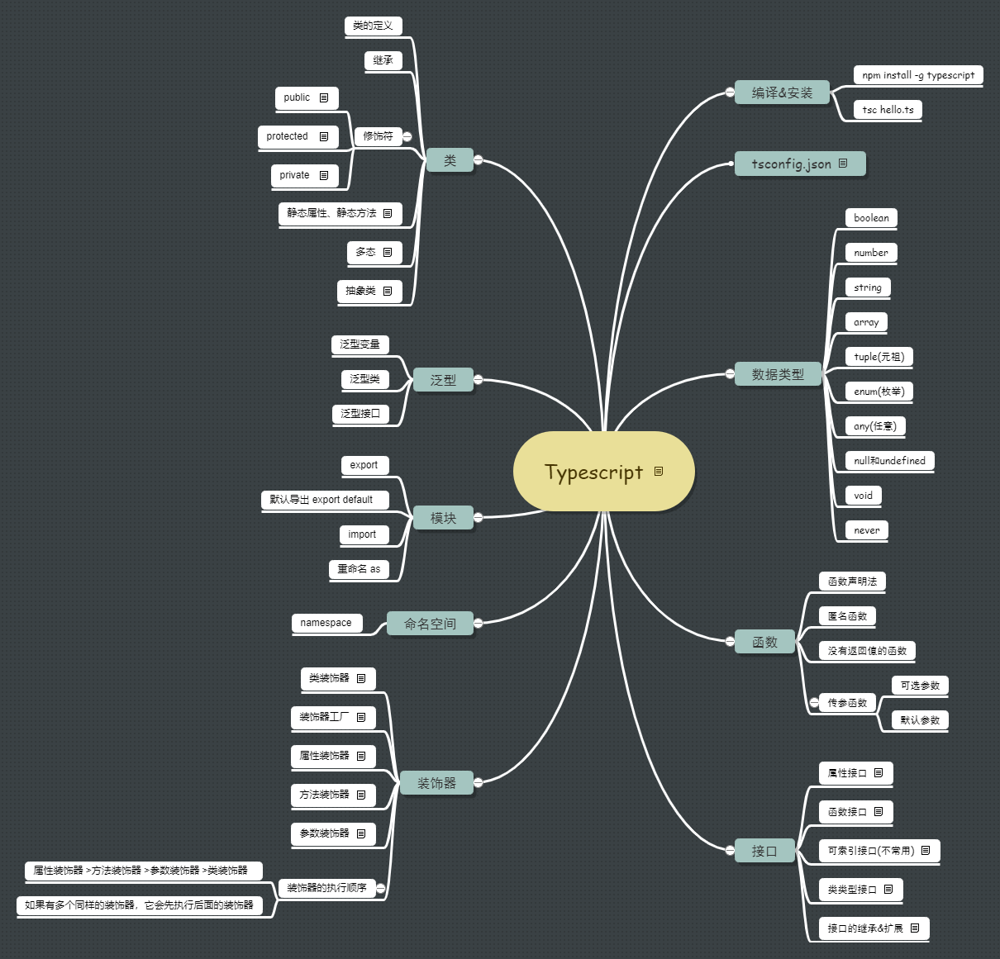

# 介绍&安装&编译

## 介绍

- TypeScript 是由微软开发的一款开源的语言

- TypeScript 是 js 的超集（遵循最新的 es5，es6 规范，扩展了 js 的语法）

- TypeScript 可以让 js 开发大型企业项目

- angular2.x 就是基于 TypeScript 的语法，最新的 vue 和 react 都可以集成 TypeScript

- 官方约定使用 TypeScript 编写的文件以 `.ts` 为后缀，用 TypeScript 编写 React 时，以 `.tsx` 为后缀

## 安装

- 通过 npm 安装 `npm install -g typescript`

- 安装 Visual Studio 的 TypeScript 插件

## 编译

- 最基础的编译命令行是 `tsc hello.ts`

- 通用的编译方式是在根文件建立 `tsconfig.json` 文件
